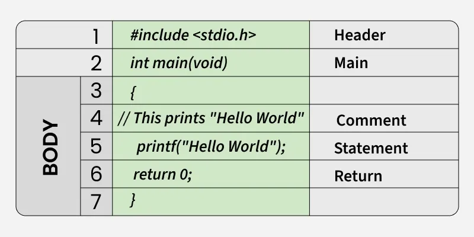

# C Language Introduction

**C** is a general-purpose procedural programming language initially developed by **Dennis Ritchie** in **1972** at **Bell Laboratories of AT&T Labs**. It was mainly created as a system programming language to write the **UNIX operating system**.

## Why Learn C?

C is considered mother of all programming languages as many later languages like Java, PHP and JavaScript have borrowed syntax/features directly or indirectly from the C.
If a person learns C programming first, it helps to learn any modern programming language as it provide a deeper understanding of the fundamentals of programming and underlying architecture of the operating system like pointers, working with memory locations etc.
C is widely used in operating systems, embedded systems, compilers, databases, networking, game engines, and real-time systems for its efficiency to work in low resource environment and hardware-level support.

## Writing First Program in C Language

This simple program demonstrates the basic structure of a C program. It will also help us understand the basic syntax of a C program.

```c
#include <stdio.h>
int main(void)
{
    // This prints "Hello World"
    printf("Hello World");
    return 0;  
}
```

### **Output**

```bash
Hello World
```

Let us analyse the structure of our program line by line.

## Structure of the C program

After the above discussion, we can formally assess the basic structure of a C program. By structure, it is meant that any program can be written in this structure only. Writing a C program in any other structure will lead to a Compilation Error. The structure of a C program is as follows:



### Header Files Inclusion - Line 1 [#include <stdio.h>]

The first component is the Header files in a C program. A header file is a file with extension .h which contains C function declarations and macro definitions to be shared between several source files. All lines that start with # are processed by a preprocessor which is a program invoked by the compiler. In the above example, the preprocessor copies the preprocesses code of stdio.h to our file. The .h files are called header files in C.
Some of the C Header files:

- `stddef.h` - Defines several useful types and macros.
- `stdint.h` - Defines exact width integer types.
- `stdio.h` - Defines core input and output functions.
- `stdlib.h` - Defines numeric conversion functions, pseudo-random number generator, and memory allocation.
- `string.h` - Defines string handling functions.
- `math.h` - Defines common mathematical functions.

### Main Method Declaration - Line 2 [int main()]

The next part of a C program is the main() function. It is the entry point of a C program and the execution typically begins with the first line of the main(). The empty brackets indicate that the main doesn't take any parameter (See this for more details). The int that was written before the main indicates the return type of main(). The value returned by the main indicates the status of program termination.

### Body of Main Method - Line 3 to Line 6 [enclosed in {}]

The body of the main method in the C program refers to statements that are a part of the main function. It can be anything like manipulations, searching, sorting, printing, etc. A pair of curly brackets define the body of a function. All functions must start and end with curly brackets.

### Comment - Line 7[// This prints "Hello World"]

The comments are used for the documentation of the code or to add notes in your program that are ignored by the compiler and are not the part of executable program .

### Statement - Line 4 [printf("Hello World");]

Statements are the instructions given to the compiler. In C, a statement is always terminated by a semicolon (`;`). In this particular case, we use printf() function to instruct the compiler to display "Hello World" text on the screen.

### Return Statement - Line 5 [return 0;]

The last part of any C function is the return statement. The return statement refers to the return values from a function. This return statement and return value depend upon the return type of the function. The return statement in our program returns the value from main(). The returned value may be used by an operating system to know the termination status of your program. The value 0 typically means successful termination.

## Execute C Programs

In order to execute the above program, we need to first compile it using a compiler and then we can run the generated executable. There are online IDEs available for free like GeeksforGeeksIDE, that can be used to start development in C without installing a compiler.

If you want to run the programs in your computer, then you will have to create a development environment for C. A development environment consists mainly consists of a text editor, which is used to write the code, and a compiler that converts the written code into the executable file. Refer to this article - Setting Up C Development Environment

Ensure you are in the directory containing the C source file and then run the following command in your terminal to compile the program:

```bash
gcc -o hello 000_intro.c
./hello
```

## Difference Between C and C++

C++ was created to add the OOPs concept into the C language so they both have very similar syntax with a few differences. The following are some of the main differences between C and C++ Programming languages.

| Feature             | C                                                                 | C++                                                                                     |
|---------------------|-------------------------------------------------------------------|-----------------------------------------------------------------------------------------|
| **Paradigm**        | Procedural programming                                            | Procedural, Object-Oriented, Generic                                                    |
| **OOPs**            | Not supported                                                     | Supports OOPs concepts with classes, inheritance, polymorphism, and encapsulation        |
| **Memory Management** | Manual using `malloc()`, `calloc()`, `free()`, etc.              | Both manual and automatic (using `new`, `delete` for dynamic allocation and deallocation) |
| **Function Overloading** | Not supported (function names must be unique)                  | Supports function overloading                                                           |
| **Operator Overloading** | Not supported (every operator performs a unique operation)     | Supports operator overloading; allows custom behaviors for operators like `+`, `-`, `*`, etc. |
| **Access Control**  | Doesn’t have any access control mechanism                         | Supports access control using keywords like `private`, `public`, `protected`            |

## Application of C Language

C language is being used since the early days of computer programming and still is used in wide variety of applications such as:

C is used to develop core components of operating systems such as Windows, Linux, and macOS.
C is applied to program embedded systems in small devices such as washing machines, microwave ovens, and printers.
C is utilized to create efficient and quick game engines. For example, the Doom video game engine was implemented using C.
C is employed to construct compilers, assemblers, and interpreters. For example, the CPython interpreter is written partially using C.
C is applied to develop efficient database engines. The MySQL database software is implemented using C and C++.
C is employed to create programs for devices and sensors of Internet of Things (IoT). A common example is a house automation system comprising temperature sensors and controllers that is often prepared with C.
C is employed for creating lightweight and speedy desktop applications. The widely used text editor Notepad++ employs C for performance-sensitive sections.

## History Of C

C is a general-purpose procedural programming language developed by Dennis Ritchie in 1972 at Bell Labs to build the UNIX operating system. It provides low-level memory access, high performance, and portability, making it ideal for system programming. Over the years, C has evolved through standards like ANSI C, C99, C11, and C23, adding modern features while retaining its simplicity.
