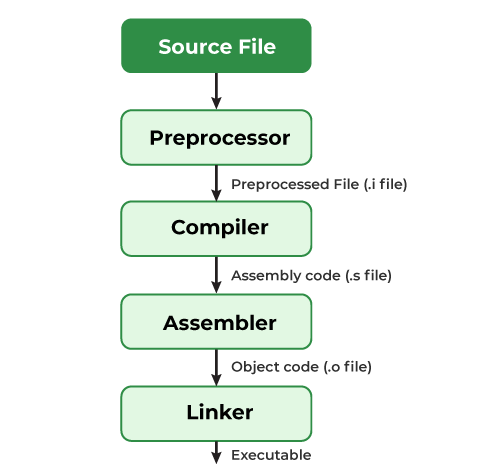

# Compiling a C Program: Behind the Scenes

The compilation is the process of converting the source code of the C language into machine code. As C is a mid-level language, it needs a compiler to convert it into an executable code so that the program can be run on our machine.

## Overview

The compilation process consists of four main stages:

1. Preprocessing
2. Compilation
3. Assembly
4. Linking



Understanding the compilation process in C helps developers optimize their programs.

## How do we compile and run a C program?

We first need a compiler and a code editor to compile and run a C Program. The below example is of an Ubuntu machine with GCC compiler.

**Step 1: Creating a C Source File**
We first create a C program using an editor and save the file as `compile.c` In linux, we can use `vi` to create a file from the terminal using the command:

```bash
vi compile.c
```

In windows, we can use the Notepad to do the same. Then write a simple hello world program and save it.

```c
// This is a simple C program
// It prints "Hello World"

#include <stdio.h>

int main(void)
{
    // This prints "Hello World"
    printf("Hello World\n");
    return 0;  
}
```

**Step 2: Compiling using GCC compiler**
We use the following command in the terminal for compiling our compile.c source file.

```bash
gcc compile.c -o compile
```

We can pass many instructions to the GCC compiler to different tasks such as:

The option -Wall enables all compiler's warning messages. This option is recommended to generate better code.
The option -o is used to specify the output file name. If we do not use this option, then an output file with the name a.out is generated.
If there are no errors in our C program, the executable file of the C program will be generated.

**Step 3: Executing the program**
After compilation executable is generated and we run the generated executable using the below command.

```bash
 ./compile // for linux
 compile // for windows
```

The program will be executed, and the output will be shown in the terminal.

What goes inside the compilation process?
A compiler converts a C program into an executable. There are four phases for a C program to become an executable:

1. Pre-processing
2. Compilation
3. Assembly
4. Linking
By executing the below command while compiling the code, we get all intermediate files in the current directory along with the executable.

```bash
gcc -Wall -save-temps compile.c -o compile
```

The above command generates the following intermediate files:

**1. Pre-processing**
This is the first phase through which source code is passed. This phase includes:

- Removal of Comments
- Expansion of Macros
- Expansion of the included files
- Conditional compilation

The pre-processed output is stored in the `compile.i`. Let’s see what’s inside `compile.i`: using `$vi compile.i`

In the above output, the source file is filled with lots and lots of info, but in the end, our code is preserved.

`printf` contains now `a + b` rather than `add(a, b)` that’s because macros have expanded.
Comments are stripped off.
`#include<stdio.h>` is missing instead we see lots of code. So header files have been expanded and included in our source file.
**2. Compiling**
The next step is to compile `compile.i` and produce an; intermediate compiled output file `compile.s`. This file is in assembly-level instructions. Let’s see through this file using `$nano compile.s`  terminal command.
The snapshot shows that it is in assembly language, which the assembler can understand.
**3. Assembling**
In this phase the `compile.s` is taken as input and turned into `compile.o` by the assembler. This file contains machine-level instructions. At this phase, only existing code is converted into machine language, and the function calls like `printf()` are not resolved. Let’s view this file using ```$vi compile.o```
generated binary code in c compilation
**4. Linking**
This is the final phase in which all the linking of function calls with their definitions is done. Linker knows where all these functions are implemented. Linker does some extra work also: it adds some extra code to our program which is required when the program starts and ends. For example, there is a code that is required for setting up the environment like passing command line arguments. This task can be easily verified by using size `compile.o` and size `compile`. Through these commands, we know how the output file increases from an object file to an executable file. This is because of the extra code that Linker adds to our program.

Linking can be of two types:

- **Static Linking:** All the code is copied to the single file and then executable file is created.
- **Dynamic Linking:** Only the names of the shared libraries is added to the code and then it is referred during the execution.
GCC by default does dynamic linking, so `printf()` is dynamically linked in above program.

## Conclusion

In this section, we have explored the compilation process of a C program in detail. We started with the source code and went through all the intermediate steps to finally obtain an executable file. Understanding this process is crucial for debugging and optimizing C programs.
