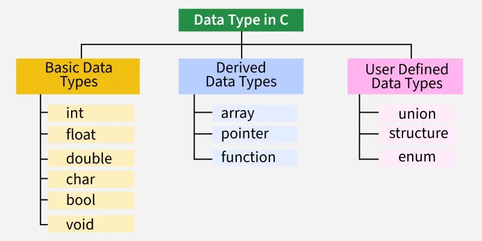

# Data Types in C

---

Each variable in C has an associated **data type**. It s**pecifies the type of data that the variable can store** like `integer`, `character`, `floating`, `double`, etc.

Example:

```c
int number;
```

The above statement declares a variable with name number that can store integer values.

C is a **statically type language** where each variable's type must be specified at the declaration and once specified, it cannot be changed.



**Note**: The different data types mentioned below are the most commonly used values. The actual values may vary from compiler to compiler.

---

## Integer Data **Type**

The **integer datatype** in C is used to store the integer numbers (any number including positive, negative and zero without decimal part). Octal values, hexadecimal values, and decimal values can also be stored in int data type in C.

- Range:  `-2,147,483,648` to `2,147,483,647`
- Size: 4 bytes
- Format Specifier: `%d`
- Format specifiers are the symbols that are used for **printing & scanning values** of given data types.

**Example**:

```c
// We use int keyword to declare the integer variable:
int val;
```

We can store the integer values (literals) in this variable.

```c
#include <stdio.h>
​
int main() {
    int var = 22;
    
    printf("var = %d", var);
    return 0;
}
```

**Output**:

```bash
var = 22
```

A variable of given data type **can only contains the values of the same type**. So, var can only store numbers, not text or anything else.

The integer data type can also be used as:

- **`unsigned int`**: It can store the data values from zero to positive numbers, but it can’t store negative values
- **`short int`**: It is lesser in size than the int by 2 bytes so can only store values from `-32,768` to `32,767`.
- **`unsigned short int`**: Similar in relationship with short int as unsigned int with int.
- **`long int`**: Larger version of the int datatype so can store values greater than int.

**Note**: The size of an integer data type is compiler dependent. We can use sizeof operator to check the actual size of any data type.

---

## Character Data Type

**Character data type** allows its variable to **store only a single character**. The size of **the character is 1 byte**. It is the most basic data type in C. It stores a single character and requires a single byte of memory in almost all compilers.

- Range: `(-128 to 127)` or `(0 to 255)`
- Size: 1 byte
- Format Specifier: `%c`

**Example**:

```c
#include <stdio.h>
​
int main() {
    char ch = 'A';
    
    printf("ch = %c", ch);
    return 0;
}
```

**Output**:

```bash
ch = A
```

---

## Float Data Type

In C programming, **float data type** is used to **store single precision floating-point values**. These values are **decimal** and **exponential numbers**.

- Range: `1.2E-38` to `3.4E+38`
- Size: 4 bytes
- Format Specifier: `%f`

**Example**:

```c
#include <stdio.h>
​
int main() {
    float val = 12.45;
    
    printf("val = %f", val);
    return 0;
}
```

**Output**:

```bash
val = 12.450000
```

---

## Double Data Type

The **double data type** in C is used to **store decimal numbers (numbers with floating point values) with double precision**. It can easily accommodate about 16 to 17 digits after or before a decimal point.

- Range: `1.7E-308` to `1.7E+308`
- Size: 8 bytes
- Format Specifier: `%lf`

**Example**:

```c
#include <stdio.h>
​
int main() {
    double val = 1.4521;
    
    printf("val = %lf", val);
    return 0;
}
```

**Output**:

```bash
val = 1.452100
```

---

## Void Data Type

The **void data type** in C is used to indicate the absence of a value. Variables of void data type are not allowed. It can only be used for **pointers and function return type & parameters**.

**Example**:

```c
void fun(int a, int b){
    // function body
}
// where function fun is a void type of function means it doesn't return any value.
```

---

## Size of Data Types in C

The size of the data types in C is dependent on the size of the architecture, so we cannot define the universal size of the data types. For that, the C language provides the sizeof() operator to check the size of the data types.

**Example**:

```c
#include <stdio.h>
​
int main(){
    
    // Use sizeof() to know size
    // the data types
    printf("The size of int: %d\n",
        sizeof(int));
    printf("The size of char: %d\n",
        sizeof(char));
    printf("The size of float: %d\n",
        sizeof(float));
    printf("The size of double: %d",
        sizeof(double));
​
    return 0;
}
```

**Output**:

```bash
The size of int: 4
The size of char: 1
The size of float: 4
The size of double: 8
```

Different data types also have different ranges up to which can vary from compiler to compiler. Below is a list of ranges along with the memory requirement and format specifiers on the **64-bit GCC compiler**.

| Data Type               | Size (bytes) | Range                                      | Format Specifier |
|--------------------------|--------------|--------------------------------------------|------------------|
| short int               | 2            | -32,768 to 32,767                          | %hd              |
| unsigned short int      | 2            | 0 to 65,535                                | %hu              |
| unsigned int            | 4            | 0 to 4,294,967,295                         | %u               |
| int                     | 4            | -2,147,483,648 to 2,147,483,647            | %d               |
| long int                | 4            | -2,147,483,648 to 2,147,483,647            | %ld              |
| unsigned long int       | 4            | 0 to 4,294,967,295                         | %lu              |
| long long int           | 8            | -(2^63) to (2^63)-1                        | %lld             |
| unsigned long long int  | 8            | 0 to 18,446,744,073,709,551,615            | %llu             |
| signed char             | 1            | -128 to 127                                | %c               |
| unsigned char           | 1            | 0 to 255                                   | %c               |
| float                   | 4            | 1.2E-38 to 3.4E+38                         | %f               |
| double                  | 8            | 1.7E-308 to 1.7E+308                       | %lf              |
| long double             | 16           | 3.4E-4932 to 1.1E+4932                     | %Lf              |

**Note**: The **long**, **short**, **signed** and **unsigned** are datatype modifier that can be used with some primitive data types to change the size or length of the datatype.

---

## Literals in C

In C, **literals** are **constant values assigned to variables**. They represent fixed values that are **immutable**. Literals o**ccupy memory but do not have references** like variables. Often, the terms constants and literals are used interchangeably.

---

## Type Conversion

In C, **type conversion** is the process of **changing one data type into another**. This can happen automatically by the compiler or manually by the programmer. Type conversion is only performed between data types where such a conversion is possible.

---
